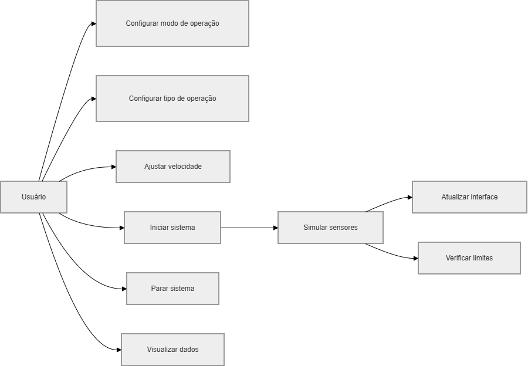

# Análise orientada a objeto

## 1. Descrição Geral do Domínio do Problema

Este projeto tem como objetivo o desenvolvimento de uma aplicação para simulação de uma **máquina de tração e compressão**, utilizando o paradigma de Programação Orientada a Objetos, com implementação futura em C++ e framework Qt.

A máquina simulada representa o comportamento de um cilindro pneumático, sendo capaz de executar movimentos de avanço (compressão) e retorno (tração). Nesta implementação, não serão utilizados sensores físicos, os dados de operação serão gerados de forma simulada, respeitando intervalos e comportamentos esperados.

O sistema permitirá ao usuário controlar e monitorar a operação da máquina por meio de uma interface gráfica interativa.

---

## 2. Funcionalidades do Sistema

O sistema deverá ser capaz de:

- Operar nos modos:
  - Tração  
  - Compressão  

- Operar em:
  - Modo manual  
  - Modo automático  

- Monitorar:
  - Posição do cilindro  
  - Força aplicada  
  - Pressão simulada  

- Controlar:
  - Velocidade do movimento  
  - Direção do movimento  

- Fornecer:
  - Interface gráfica interativa  
  - Visualização de dados em tempo real  

---

## 3. Atores do Sistema

Os atores representam entidades externas que interagem com o sistema.

- **Usuário**: responsável por operar, configurar e monitorar o funcionamento da máquina.

---

## 4. Diagrama de Casos de Uso

O diagrama de casos de uso apresenta as funcionalidades do sistema do ponto de vista do usuário.

---

## 5. Descrição dos Casos de Uso

### UC01 – Configurar modo de operação
Permite ao usuário selecionar entre modo manual e automático.

### UC02 – Configurar tipo de operação
Permite escolher entre tração ou compressão.

### UC03 – Ajustar velocidade
Define a velocidade de operação do cilindro.

### UC04 – Iniciar sistema
Inicia a execução da simulação da máquina.

### UC05 – Parar sistema
Interrompe a operação do sistema.

### UC06 – Visualizar dados
Permite o monitoramento em tempo real das seguintes variáveis:
- Força  
- Pressão  
- Posição  

---

## 6. Modelo Conceitual (Diagrama de Classes Conceitual)

Este diagrama apresenta os principais elementos do sistema e suas relações, sem considerar detalhes de implementação.

---

## 7. Descrição do Modelo Conceitual

O sistema é composto pelas seguintes entidades principais:

### 🔵 Usuário
Representa o operador do sistema, responsável por interagir com a aplicação.

### 🔵 Interface
Responsável pela interação com o usuário:
- Exibir dados  
- Receber comandos  

### 🔵 Controlador
Coordena o funcionamento do sistema:
- Controla o fluxo de execução  
- Processa dados simulados  

### 🔵 Sensor Simulado
Gera artificialmente os dados do sistema:
- Força  
- Pressão  
- Posição  

### 🔵 Cilindro
Representa o comportamento físico da máquina:
- Movimento  
- Velocidade  
- Posição  

### 🔵 Dados
Contém as informações geradas e utilizadas durante a operação.

---

## 8. Considerações Finais

Durante a etapa de análise orientada a objeto, foram identificados:

- Os principais atores do sistema  
- As funcionalidades essenciais  
- Os elementos conceituais e suas relações  

Essas definições servem como base para a próxima fase do desenvolvimento, correspondente ao **projeto orientado a objeto**, onde serão definidos os detalhes técnicos da solução, incluindo estrutura de classes e comportamento do sistema.

---

[Voltar](README.md) | [Avançar](projeto.md)

