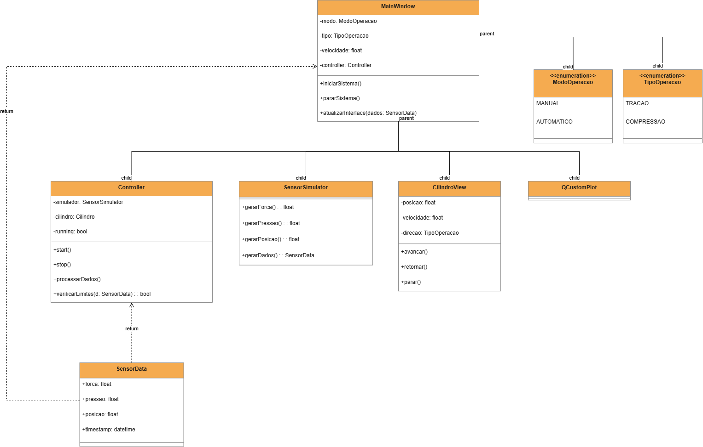
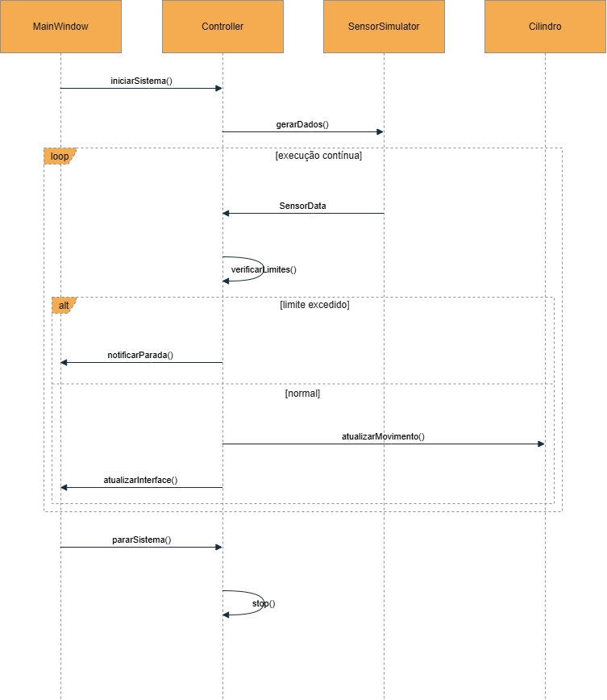
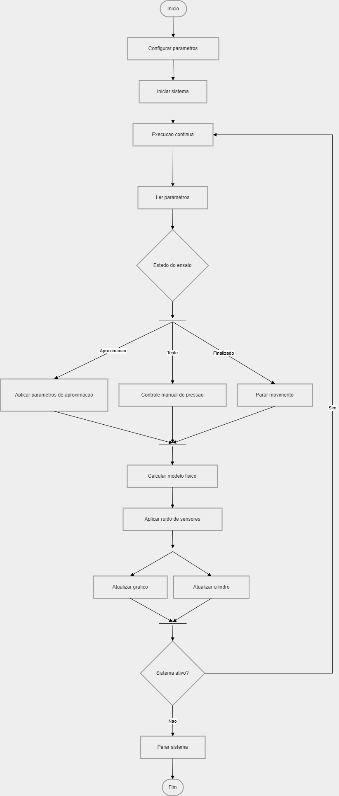

# Projeto orientado a objeto

> Esta etapa descreve a solução proposta para o sistema, a partir da análise previamente realizada, detalhando a estrutura das classes, suas responsabilidades, interações e evolução do comportamento do sistema.

---

## 1. Visão Geral da Arquitetura

O sistema foi projetado com base nos princípios da Programação Orientada a Objetos, buscando uma separação clara de responsabilidades entre os componentes.

A arquitetura adotada segue uma abordagem semelhante ao padrão **Model-View-Controller (MVC)**, com as seguintes divisões:

- **View (Interface)**: responsável pela interação com o usuário  
- **Controller (Controle)**: responsável pela lógica da aplicação  
- **Model (Dados/Simulação)**: responsável pela representação e geração dos dados  

Essa separação permite maior organização, facilidade de manutenção e escalabilidade.

---

## 2. Diagrama de Classes

O diagrama de classes apresenta a estrutura estática do sistema, incluindo classes, atributos, métodos e relacionamentos.

---

## 3. Descrição das Classes

### --> mainWindow (Controller + View)

Responsável pelo controle e interface gráfica do sistema.

**Atributos:**
- Estado e controle:
    - tempo: double
    - posicaoAtual: double
    - deslocamentoMinimo: double
    - deslocamentoMaximo: double

    - ModoOperacao modoAtual;
    - EstadoEnsaio estadoEnsaio;

    - pressaoTesteSetpoint: double

- Componentes de controle
    - Controller *controller;
    - SensorSimulator *sensor;

- Interface - elementos principais
    - Botões:
        - QPushButton *btnStart;
        - QPushButton *btnStop;
        - QPushButton *btnReset;
    - Labels:
        - QLabel *labelForca;
        - QLabel *labelPressao;
        - QLabel *labelPosicao;
        - QLabel *labelPressaoControle;
        - QLabel *labelVazao;
    - Sliders:
        - QSlider *sliderPressao;
        - QSlider *sliderVazao;
    - Seletor:
        - QRadioButton *radioAvanco;
        - QRadioButton *radioRetorno;
    - Campos (entradas):
        - QLineEdit *campoAltura;
        - QLineEdit *campoVelAprox;
        - QLineEdit *campoPressaoAprox;
        - QLineEdit *campoVelTeste;
        - QLineEdit *campoPressaoTeste;
    - Layout / grupos:
        - QGroupBox *grupoTeste;
    - Visualização:
        - QCustomPlot *grafico;
        - QCPGraph *curvaForca;
        - CilindroView *cilindroView;

**Métodos:**
- Públicos:
    - MainWindow(QWidget *parent = nullptr);
    - ~MainWindow();
- Slots (lógica principal):
    - void iniciarSistema();
    - void pararSistema();
    - void atualizarUIParaModo();
    - void atualizarInterface(const SensorData &dados);
- Métodos internos:
    - void setupUI();

**Responsabilidade:**
- Interface:
    - Criar interface gráfica (setupUI)
    - Atualizar elementos visuais
    - Gerenciar gráficos
    - Exibir dados do sistema
- Controle do usuário:
    - Iniciar sistema (Start)
    - Parar sistema (Stop)
    - Resetar ensaio (Reset)
    - Alterar modo (Manual / Automático)
- Controle do ensaio:
    - Gerenciar estados (Aproximação -> Teste -> Finalizado)
    - Implementar lógica de transição
    - Controlar comportamento automático
- Modelo físico (simples)
    - Calcular:
        - força
        - velocidade
        - posição
    - Aplicar limites (curso e contato)
- Integração de componentes
    - Receber dados do Controller
    - Usar SensorSimulator
    - Atualizar CilindroView
- Sincronização UI <-> Lógica
    - Manter coerência entre:
        - Slider
        - Campos
        - Setpoint interno

---

### --> SensorSimulator

Responsável pela simulação dos sensores.

**Métodos:**
- gerarForca(): float  
- gerarPressao(): float  
- gerarPosicao(): float  
- gerarDados(): SensorData  

**Responsabilidade:**
- Gerar valores simulados realistas  
- Substituir sensores físicos  

---

### --> SensorData

Classe responsável por armazenar os dados do sistema.

**Atributos:**
- forca: float  
- pressao: float  
- posicao: float  
- timestamp: datetime  

**Responsabilidade:**
- Transportar dados entre os componentes  

---

### --> Cilindro

Representa o comportamento do atuador da máquina.

**Atributos:**
- posicao: float  
- velocidade: float  
- direcao: TipoOperacao  

**Métodos:**
- avancar()  
- retornar()  
- parar()  

**Responsabilidade:**
- Simular o movimento do cilindro  
- Representar o estado físico do sistema  

---

### --> Enumerações

#### ModoOperacao
Define o modo de operação do sistema:
- MANUAL  
- AUTOMATICO  

#### TipoOperacao
Define o tipo de movimento:
- TRACAO  
- COMPRESSAO  

---

## 4. Relacionamentos entre Classes
- Associações:
    - A classe **MainWindow** interage com:
        - **Controller** para iniciar e parar o sistema;
        - **SensorSimulator** para emular as leituras dos sensores;
        - **CilindroView** para simular o funcionamento do cilindro atuador;
        - **QCustomPlot** para exibir o gráfico da força aplicada pelo cilindro;
- Dependências:
    - **MainWindow** depende de **SensorData** para obter os dados gerados;
    - **Controller** depende de **SensorData** para representar o estado da máquina;

- Herança:
    - **MainWindow** herda elementos de QWidget;
    - **CilindroView** herda elementos de QWidget;

- Os dados gerados são encapsulados na classe **SensorData**  
- A interface utiliza os dados para atualização visual  

Essa estrutura reduz o acoplamento e melhora a organização do sistema.

---

## 5. Diagrama de Sequência

O diagrama de sequência representa a interação entre os componentes ao longo do tempo.

### Descrição

O diagrama de sequência representa o fluxo de interação entre os componentes do sistema durante a execução de um ensaio.

1. O usuário inicia o sistema através da interface (MainWindow), acionando o comando de início.
2. A classe MainWindow solicita ao Controller o início da execução do sistema por meio do método `start()`.
3. O Controller passa a emitir sinais periódicos (`dadosAtualizados`), caracterizando o ciclo contínuo de execução.
4. A cada sinal recebido, a MainWindow executa o método `atualizarInterface()`, que concentra a lógica principal do sistema.
5. Durante essa atualização, o sistema realiza:
   - leitura dos parâmetros definidos pelo usuário
   - avaliação do estado atual do ensaio (Aproximacao, Teste ou Finalizado)
   - aplicação das regras da máquina de estados
   - cálculo do modelo físico (velocidade, posição e força)
6. Os valores calculados são então processados pelo SensorSimulator, que aplica ruído para simular o comportamento de sensores reais.
7. Com os dados processados, a MainWindow atualiza os elementos da interface:
   - gráfico (força ao longo do tempo)
   - posição do cilindro (CilindroView)
   - valores exibidos ao usuário
8. Esse ciclo se repete continuamente enquanto o sistema estiver em execução.
9. Quando o usuário solicita a parada, a MainWindow envia o comando `stop()` ao Controller, interrompendo o ciclo.
10. O usuário também pode reiniciar o ensaio por meio da função de reset, que redefine o estado do sistema, a posição do cilindro e os dados do gráfico.

---

## 6. Diagrama de Atividades

O diagrama de atividades apresenta o fluxo de execução do sistema.

### Descrição

O diagrama de atividades representa o fluxo de execução do sistema durante a realização de um ensaio, desde a inicialização até o encerramento da operação.

O fluxo segue as seguintes etapas:

1. O sistema inicia com a configuração dos parâmetros pelo usuário, incluindo pressão, vazão e altura do objeto de ensaio.
2. Após a configuração, o usuário inicia a operação, acionando o funcionamento do sistema.
3. O sistema entra em um ciclo contínuo de execução, no qual a interface realiza a atualização periódica dos dados.
4. Durante cada ciclo, são realizadas as seguintes etapas:
   - leitura dos parâmetros definidos pelo usuário
   - avaliação do estado do ensaio (Aproximacao, Teste ou Finalizado)
   - aplicação das regras da máquina de estados
   - cálculo do modelo físico (posição, velocidade e força)
5. Os valores calculados são processados pelo simulador de sensores, responsável pela aplicação de ruído para representar medições reais.
6. Em seguida, o sistema atualiza a interface gráfica, incluindo:
   - o gráfico de força ao longo do tempo
   - a posição do cilindro
   - os valores exibidos ao usuário
7. Algumas atualizações ocorrem de forma conceitualmente paralela, como a atualização do gráfico e da visualização do cilindro.
8. Ao final de cada ciclo, o sistema verifica se a operação deve continuar.
9. Caso o sistema permaneça ativo, o ciclo se repete continuamente.
10. Caso o usuário interrompa a execução, o sistema é finalizado, podendo também ser reiniciado por meio da função de reset.

---

## 7. Decisões de Projeto

Durante o desenvolvimento do modelo, algumas decisões foram tomadas:

### ✅ Uso de simulação de sensores
Devido à ausência de hardware real, os valores são gerados artificialmente, mantendo comportamentos esperados.

### ✅ Separação de responsabilidades
O sistema foi organizado em classes com responsabilidades definidas, como interface, controle e simulação. Embora a classe MainWindow concentre parte da lógica do ensaio, a separação adotada reduz o acoplamento e permite evolução futura da arquitetura.

### ✅ Uso de enumerações
Facilita a leitura e evita erros relacionados a valores inválidos.

### ✅ Arquitetura inspirada em MVC
A arquitetura do sistema foi baseada em princípios do padrão Model-View-Controller (MVC), buscando separar interface, controle e dados. Na implementação atual, algumas responsabilidades estão concentradas na classe MainWindow, porém a estrutura adotada permite futura evolução para uma separação mais completa.

### ✅ Uso de máquina de estados
O sistema implementa uma máquina de estados para controle do ensaio automático, utilizando os estados Aproximacao, Teste e Finalizado. Essa abordagem organiza o fluxo de execução e facilita a manutenção e expansão do sistema.

---

## 8. Considerações Finais

O sistema desenvolvido evoluiu de um modelo conceitual para uma aplicação funcional, implementada em C++ utilizando o framework Qt, permitindo a simulação de uma máquina de tração e compressão com interface gráfica interativa.

A arquitetura adotada possibilitou a organização dos componentes do sistema, integrando interface, controle e simulação de forma coerente. A utilização de uma máquina de estados para o controle do ensaio automático contribuiu significativamente para a clareza do fluxo de execução e para a previsibilidade do comportamento do sistema.

O modelo implementado permite a simulação do comportamento físico do sistema, incluindo cálculo de força, velocidade e posição, bem como a aplicação de ruído para representar medições reais. A interface gráfica possibilita o acompanhamento em tempo real do ensaio, incluindo a visualização do gráfico e do movimento do cilindro.

Apesar de algumas responsabilidades estarem concentradas na classe MainWindow, a estrutura adotada permite futuras melhorias, como a separação mais completa entre interface, controle e modelo, além da incorporação de novos recursos.

De forma geral, o projeto atinge os objetivos propostos, apresentando uma solução funcional, organizada e extensível, servindo como base para evoluções futuras, como integração com hardware real, análise de dados e aprimoramento do modelo físico.

---

[Voltar](analise.md) | [Avançar](implementacao.md)

